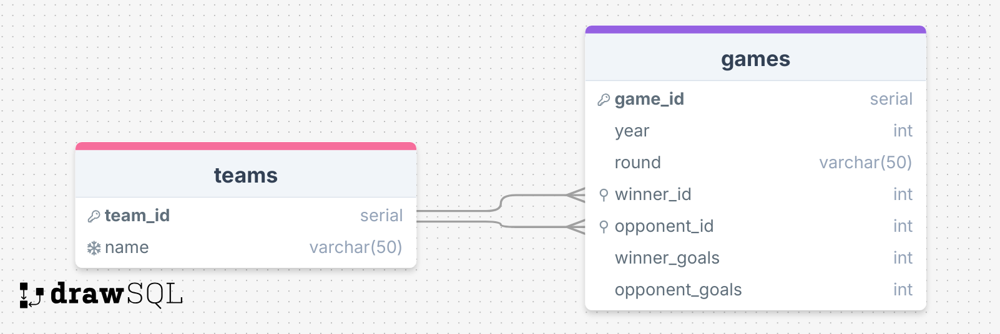

# Build a World Cup Database

- The build the database:
  - psql -U postgres < worldcup.sql
- Data is also stored in games.csv
- Find the project instructions in <a href="./instructions.md">instructions.md</a>

The following diagram represents the Entity Relationship Diagram of the database:

  
  
<em>Entity Relationship Diagram</em>

